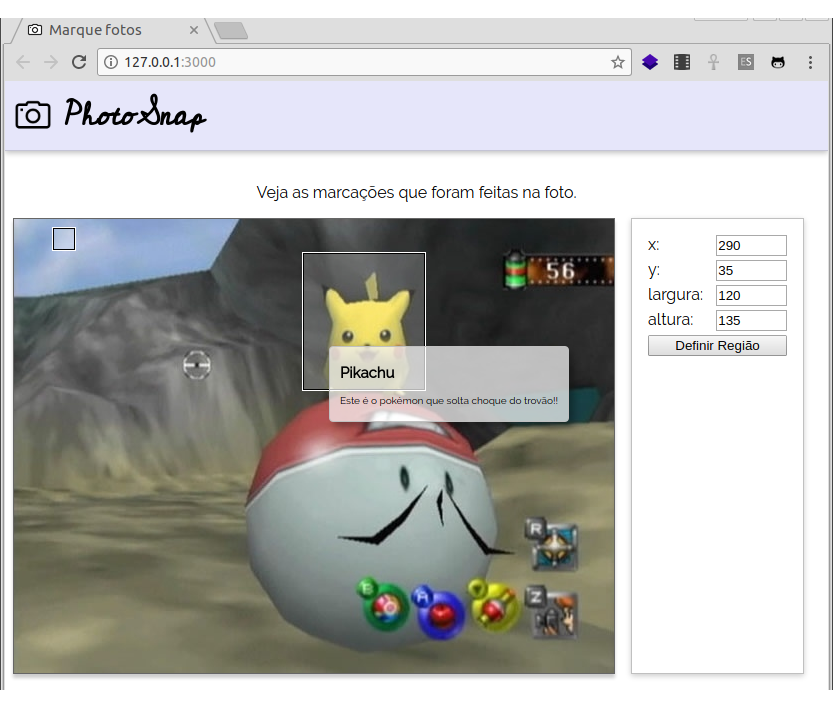
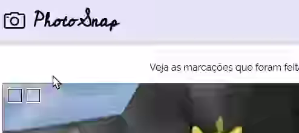
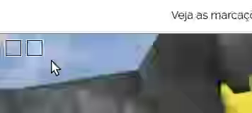
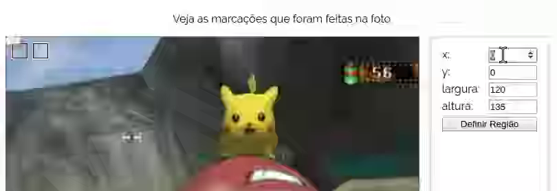

# P~~oké~~hotoSnap

Uma ferramenta para marcar suas fotos!



## Atividade

Você deve modificar a página para que ela mostre duas marcações
(~~pokémons~~) na imagem (~~foto~~). Cada marcação é definida por um
quadrado e possui um título e um conteúdo, que devem ser exibidos em
um balãozinho quando o usuário passar o mouse sobre cada uma.

### Exercício 1: Alterar/remover conteúdo do balãozinho



Crie um código JavaScript (_e.g._, `balaozinho.js`) que, para cada região
anotada (`.marcacao`, cada quadradinho dentro da imagem), define o
conteúdo do elemento `#balaozinho` (lembre-se
[como definir o conteúdo de um elemento HTML][inner-html]) com uma
string qualquer.

Você deve atrelar os devidos eventos de mouse **a cada¹** `.marcacao`
para que:

1. quando o **mouse entrar no quadradinho**, definir o conteúdo do
   `#balaozinho` como uma string qualquer
1. quando o **mouse sair do quadradinho**, definir o conteúdo como
   uma string vazia

Se acontecer do _balãozinho ficar "piscando"_ ao mexer o mouse, veja o FAQ
sobre como consertar.


¹ No momento existem duas `.marcacao`s, mas pode ser que existam muitas
outras, ou até nenhuma. Lembre-se de como
[selecionar vários elementos do DOM][selecionar-varios]. Você fez isso na
prática da exploração espacial.

### Exercício 2: Formatação do balãozinho


Estilize o `#balaozinho` para que ele se pareça com um balãozinho mesmo.
Sugestões:

- Tamanho de fonte menor (tipo `10px`)
- Cor de fundo semitransparente
- Bordinha marota
- Um espacinho interno (`padding`)
- Cantinho levemente arredondado
- Uma sombra sinistra (veja FAQ)

Além disso, faça com que o mouse fique com o `cursor` de `help` (mostra
uma interrogação em vez da setinha) quando em uma `.marcacao`.


### Exercício 3: Definir título/conteúdo correto do balãozinho


Agora, você deve substituir a "string qualquer" com um trecho HTML que
contenha o título e o conteúdo da marcação, tipo assim:

```html
<div id="balaozinho">  
  <h2>título da anotação</h2>
  <p>conteúdo da anotação</p>
</div>
```

> **Você sabia??** É possível colocar elementos HTML dentro de uma string que
> estamos atribuindo ao `innerHTML` de um elemento, tipo assim:

> ~~~js
> algumEl.innerHTML = '<span>abc</span><div>def</div>';
> ~~~

Cada `.marcacao` é uma `<div></div>` devidamente estilizada e ela
está assim:

```html
<div class="marcacao"
  data-titulo="Electrode"
  data-conteudo="Este é uma pseudo-pokébola invertida"
  style="width: 20px; height: 20px; top: 10px; left: 40px;"></div>
```

Elas possuem dois atributos "personalizados": um deles chama
`data-titulo="..."` e armazena o título daquela marcação e o outro
chama `data-conteudo="..."` e armazena o texto que deve ir dentro do
parágrafo do balãozinho.

Na verdade, nós podemos usar atributos que não existem no HTML para
nossos próprios propósitos. Basta colocar `data-novoatributo` em um
elemento (_data_ em inglês = dados em português).

Para acessar o valor desses atributos, usamos uma propriedade `dataset`
do elemento HTML, assim:

```html
<span data-dikentinha="um texto">Algum assunto</span>
```
```js
let algumEl = document.querySelector('....');
console.log(algumEl.dataset.dikentinha);
// imprime "um texto" no console
```

### Exercício 4: Posicionamento do balãozinho



Faça com que, quando o mouse se movimente dentro de uma `.marcacao`,
o `#balaozinho` se posicione nas mesmas coordenadas que o mouse. Veja
como [pegar a posição do mouse][posicao-mouse] nos slides.

### Exercício 5: Definição da 1ª marcação



Faça com que o usuário possa definir as propriedades da 1ª marcação
(`left, top, width, height`) a partir dos campos `input` à direita.

Quando o botão for clicado, as propriedades da 1ª marcação devem ser
atualizadas.

Como um mimo para os olhos do usuário, você pode colocar, em CSS, a
propriedade `transition: all 200ms ease` na `.marcacao` para que os
valores alterdos das propriedades façam uma transição suave (fica show).

### Desafio 1: Atualização mais ágil da marcação

Em vez de usar o botão para atualizar as propriedades da marcação,
faça com que assim que o usuário pressionar uma tecla em qualquer dos
`input`s, a região da marcação seja atualizada. Aí você pode até tirar o
botão do HTML.

Isso pode ser feito com o evento `keyup` (ainda não vimos) que pode ser
associado a um `input`.

### Desafio 2: Definição da marcação sendo editada

Faça com que, em vez de poder alterar apenas a 1ª marcação, o usuário
possa escolher qual delas quer atualizar.

### Desafio 3: Escolha da imagem (_hardcore!_ :bomb:)

Existe um `<input type="file">` que permite ao usuário escolher um arquivo
de seu computador. Você pode colocar um desses na página e, assim que o
usuário alterar valor desse `input` (evento `change`), seu código altera a
imagem que está sendo anotada.

Referência: https://www.html5rocks.com/en/tutorials/file/dndfiles/

## FAQ

### Balãozinho piscando quando movimento o mouse

Pode acontecer de o balãozinho ficar "piscando" quando você movimenta o
mouse em cima da marcação. Isso acontece porque o navegador entende
que ora o mouse está em cima da marcação, ora ele está em cima do
balãozinho - e isso alterna muitas vezes por segundo.

Uma forma de evitar isso é posicionar o balãozinho a uma certa distância
do mouse, em vez de exatamente na posição dele. Outra forma é falar que
a `<div id="balaozinho">...</div>` não "responde" a eventos de mouse.
É possível fazer isso bem facilmente com uma propriedade CSS no
`#balaozinho`: `pointer-events: none`.

### Como altero uma propriedade CSS de um elemento dinamicamente?

Há 2 formas, sendo uma delas colocando e tirando classes, e a outra
[alterando a propriedades CSS diretamente][alterando-estilo-via-js].

### Como fazer sombras em CSS?

Existe a propriedade `box-shadow`. Ela funciona assim:

```css
div {
  box-shadow: 4px 4px 4px silver;
}
```

O primeiro valor é o deslocamento horizontal da sombra (positivo vai para
a direita), o segundo é o vertical (positivo vai para baixo), o terceiro
é o quanto a sombra está "borrada" (para uma borda suave, coloque algo
diferente de `0`) e o quarto é a cor da sombra.

A cor da sombra, tipicamente, colocamos uma cor semitransparente
(_e.g._, `rgba(...., 0.2)`).


[inner-html]: https://fegemo.github.io/cefet-front-end/classes/js2/#alterando-o-conteudo
[selecionar-varios]: https://fegemo.github.io/cefet-front-end/classes/js2/#selecionando-varios-elementos
[posicao-mouse]: https://fegemo.github.io/cefet-front-end/classes/js3/#posicao-mouse
[alterando-estilo-via-js]: https://fegemo.github.io/cefet-front-end/classes/js3/#estilizando-elementos-dinamicamente
